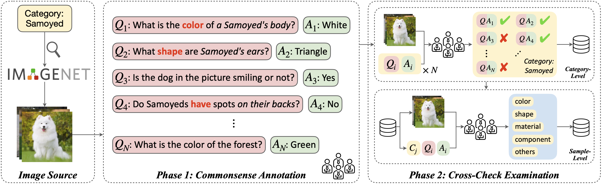
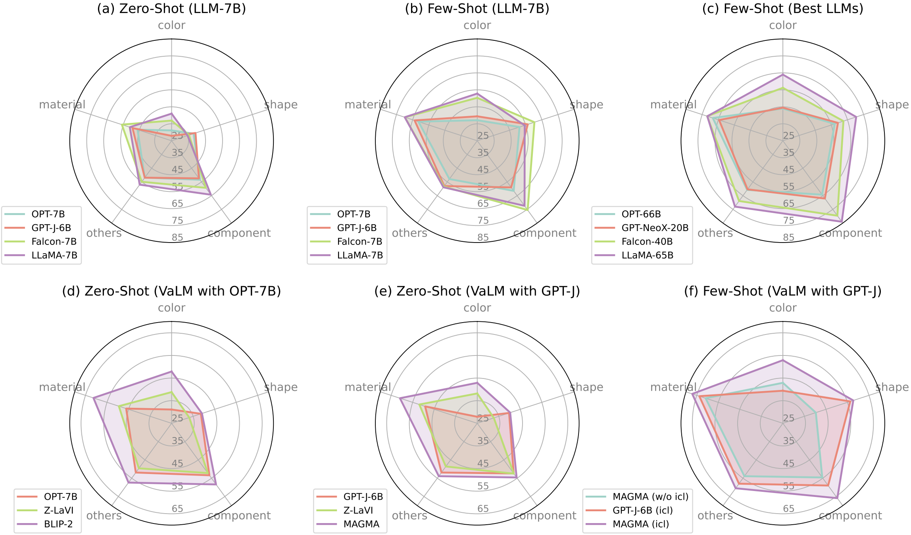

# ImageNetVC

Codes and datasets for our paper: [ImageNetVC: Zero- and Few-Shot Visual Commonsense Evaluation on 1000 ImageNet Categories](https://arxiv.org/abs/2305.15028).

You can also download our dataset through Huggingface Datasets: [hemingkx/ImageNetVC](https://huggingface.co/datasets/hemingkx/ImageNetVC).

# Overview

Recently, Large Language Models (LLMs) have been serving as general-purpose interfaces, posing a significant demand for comprehensive visual knowledge. However, it remains unclear how well current LLMs and their visually augmented counterparts (VaLMs) can master visual commonsense knowledge. 
To investigate this, we propose ImageNetVC, a human-annotated dataset specifically designed for zero- and few-shot visual commonsense evaluation across 1,000 ImageNet categories. Utilizing ImageNetVC, we benchmark the fundamental visual commonsense knowledge of both unimodal LLMs and VaLMs. Furthermore, we analyze the factors affecting the visual commonsense knowledge of large-scale models, providing insights into the development of language models enriched with visual commonsense knowledge.



# Takeaways

The main evaluation results of LLMs and VaLMs on ImageNetVC are shown in the following. Here, we highlight several interesting findings. 

- Falcon and LLaMA excel in all four presented LLM model families, especially on the color and component sub-tasks.
- In-context learning (ICL) not only improves the visual commonsense performance of LLMs but also reduces their variance across different prompts.
- VaLMs improve the visual commonsense ability of their LLM backbones, despite small performance gains on the shape subset.
- ICL capability of VaLMs should be further valued.



# How to Use

There are two folders in this repository, `LLM` and `VaLM`, representing two types of models considered in the paper: LLM and Visually-augmented LM.

For LLM, `cd LLM` and install the environment by running `pip install -r requirements.txt`. Run `ImageNetVC.py` to obtain the experimantal results on ImageNetVC.

For VaLM, `cd VaLM/BLIP-2` then follow [BLIP-2](https://github.com/salesforce/LAVIS) to install the environment and download necessary models. The code for ImagetNetVC is in `ImageNetVC.py`.

# Citation

Please kindly cite our paper if you find our datasets or code useful:

```
@article{xia2023imagenetvc,
      title={ImageNetVC: Zero- and Few-Shot Visual Commonsense Evaluation on 1000 ImageNet Categories}, 
      author={Heming Xia and Qingxiu Dong and Lei Li and Jingjing Xu and Tianyu Liu and Ziwei Qin and Zhifang Sui},
      year={2023},
      eprint={2305.15028},
      archivePrefix={arXiv},
      primaryClass={cs.CL}
}
```

